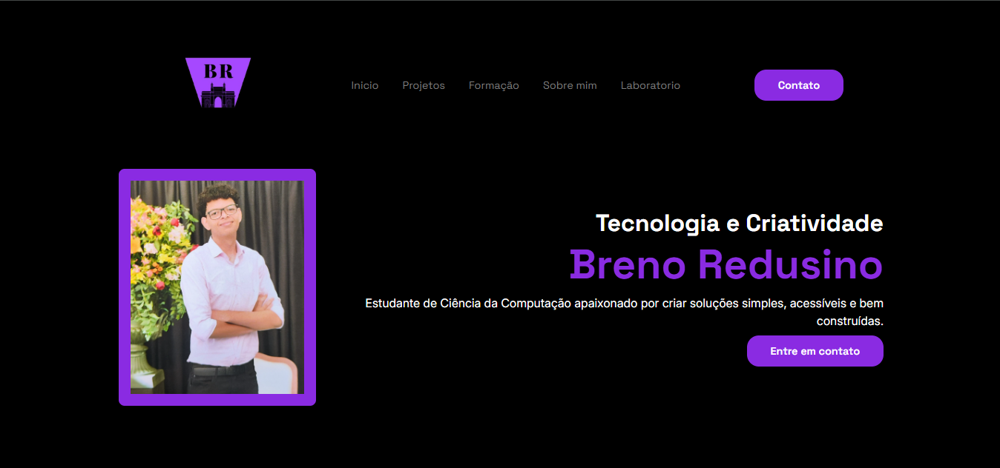
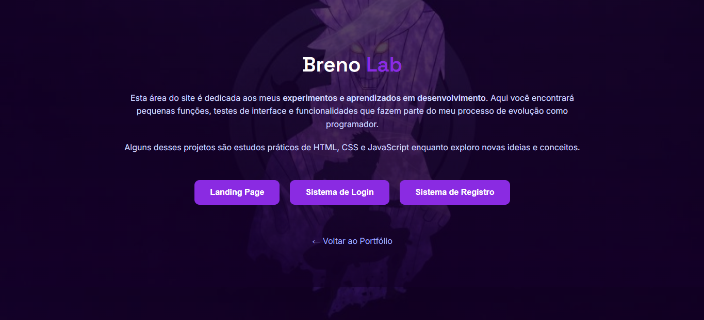
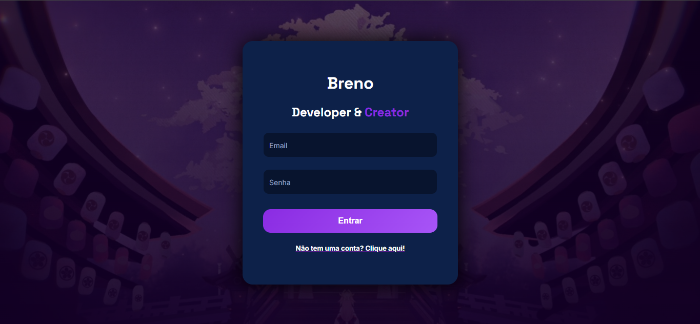
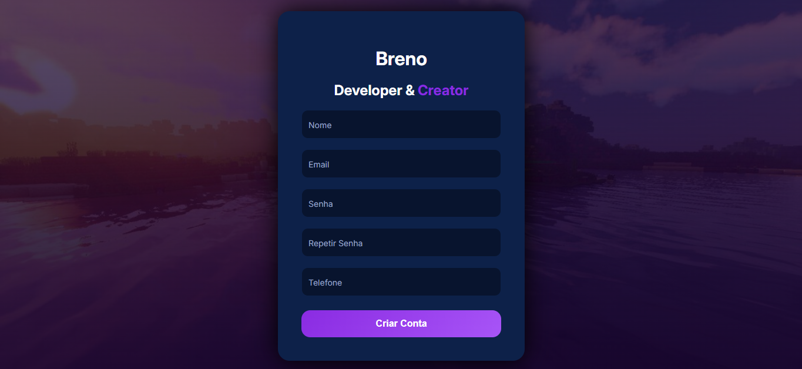

# 💜 Portfólio — Breno Redusino

<p align="center">
  
</p>

---

## ✨ Sobre o Projeto

Este projeto representa minha evolução como desenvolvedor front-end, unindo tecnologia, lógica e identidade visual em uma experiência moderna e interativa.

O portfólio foi totalmente reformulado na versão **V2** com foco em:

- Organização profissional de arquivos
- Melhoria visual
- Experiência do usuário
- Responsividade
- Identidade visual própria

Além da apresentação dos meus projetos, o sistema também conta com páginas de autenticação utilizando JavaScript e LocalStorage para simulação de login e persistência de dados.

---

## 🌐 Acesse o Projeto

🔗 **Deploy:**  
https://ybreno.github.io/portifolio-html/

---

# 🛠️ Tecnologias Utilizadas

<div align="center">

| Front-end | Recursos |
|---|---|
| HTML5 | Estrutura semântica |
| CSS3 | Estilização moderna |
| JavaScript | Interatividade |
| LocalStorage | Persistência de dados |
| Responsive Design | Responsividade |
| Dark/Light Mode | Personalização visual |

</div>

---

# ⚙️ Funcionalidades

- ✅ Interface moderna e responsiva  
- ✅ Sistema Dark Mode / Light Mode  
- ✅ Navegação dinâmica  
- ✅ Showcase de projetos pessoais  
- ✅ Sistema de login e cadastro  
- ✅ Persistência de dados com LocalStorage  
- ✅ Organização modular de arquivos  
- ✅ Design focado em UI/UX e identidade visual  

---

# 📁 Estrutura do Projeto

```txt
PORTIFOLIO-HTML/
│
├── assets/
│   │
│   ├── css/
│   │   └── pages/
│   │       ├── home.css
│   │       ├── lab.css
│   │       ├── landingpage.css
│   │       ├── login.css
│   │       ├── registro.css
│   │       └── responsiva.css
│   │
│   ├── images/
│   │   ├── fotos/
│   │   ├── projetos/
│   │   └── readme/
│   │
│   └── js/
│       ├── login.js
│       ├── main.js
│       └── registro.js
│
├── pages/
│   ├── lab.html
│   ├── landingpage.html
│   ├── login.html
│   └── registro.html
│
├── index.html
└── README.md
```

---

# 🎨 Preview

## 🏠 Página Inicial


---

## 🧪 Laboratório


---

## 🔐 Login


---

## 📝 Registro


---

# 🧠 Aprendizados

Este projeto me permitiu evoluir em:

- Estruturação de projetos front-end
- Organização de arquivos
- Responsividade
- UI/UX Design
- Manipulação do DOM
- Persistência de dados
- Componentização visual
- Identidade visual e branding
- Organização semântica em HTML
- Estrutura moderna de CSS e JavaScript

---

# 🚀 Próximos Passos

- [ ] Conectar com backend real
- [ ] Criar integração com APIs
- [ ] Melhorar acessibilidade
- [ ] Adicionar animações mais avançadas
- [ ] Evoluir partes do projeto para React
- [ ] Criar CMS próprio para projetos

---

# 👨‍💻 Autor

## Breno Redusino

<p align="center">
  <a href="https://github.com/yBreno">GitHub</a> •
  <a href="https://www.linkedin.com/in/ybreno/">LinkedIn</a> •
  <a href="https://www.instagram.com/thatsmebreno/">Instagram</a>
</p>

---

# ⭐ Se curtir o projeto

Se esse projeto te inspirou ou ajudou de alguma forma, deixa uma ⭐ no repositório! 💜
